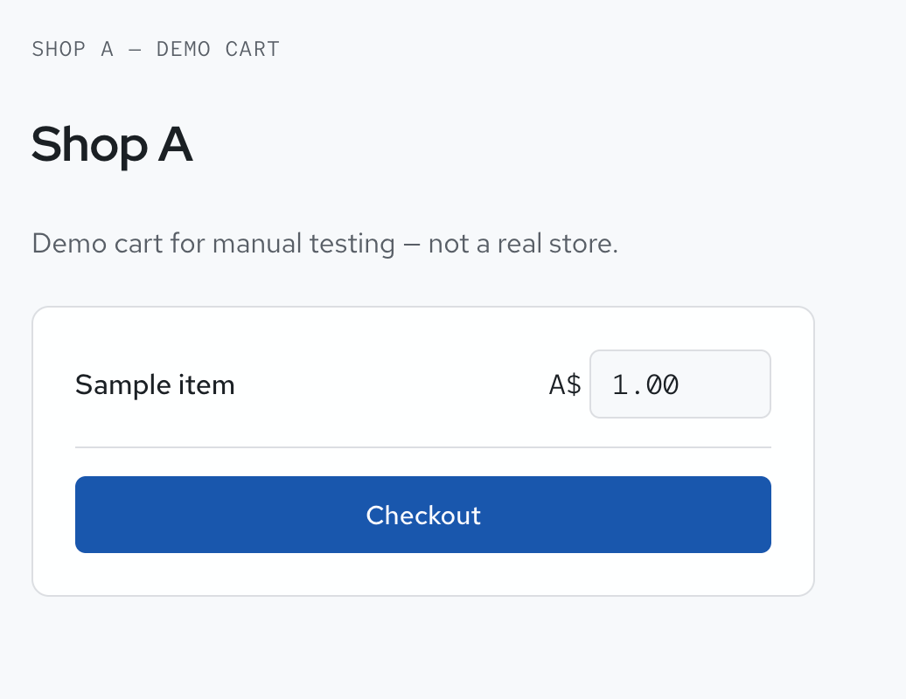
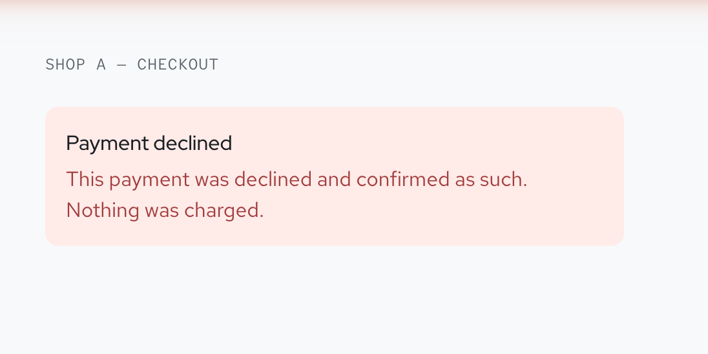
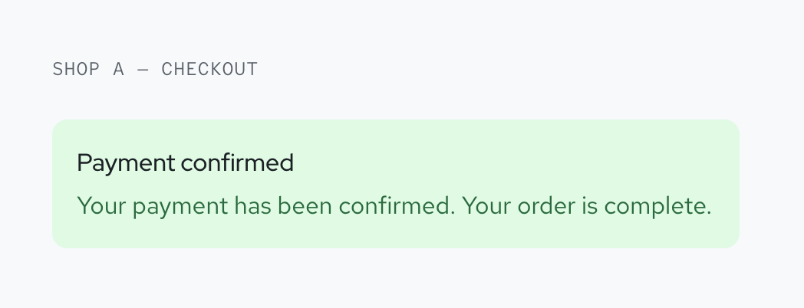

# Payments Integration: Card Lifecycle in a Sandbox Environment (WIP)

A self-directed learning project to understand how modern card payments actually
work end to end: authorisation, 3D Secure, capture, refunds, and tokenised
recurring billing, by building a real integration rather than reading about one.

I chose to build against **Adyen's test environment** as the vendor for this
exercise, since it exposes a fairly complete, well-documented API surface for
the full payment lifecycle. The concepts, state machines, and failure modes
here are general to card payments, not specific to any one processor.

Full internal specification: [`prd.md`](prd.md).

## Scope: full lifecycle of a card payment

Built as a fictional store ("Shop A") selling physical goods, with a
subscription product to justify recurring billing. This scenario was chosen
because it is the minimum setup that naturally requires every stage of the
lifecycle:

- Checkout session and hosted payment UI
- 3D Secure (frictionless, challenge, and challenge-failure paths)
- Manual capture, partial capture, cancel
- Full and partial refunds
- Tokenisation and merchant-initiated (subscription) rebills, with no shopper
  or browser present
- HMAC-verified inbound webhooks as the single source of truth for order state

Sandbox/test mode only throughout. No real money at any point.

## Status: work in progress

| Milestone | Scope | Status |
|---|---|---|
| M1 | Authenticated connection and verified webhook receiver | Done |
| M2 | A shopper pays (checkout session, webhook-driven authorisation) | Done |
| M3 | 3D Secure | Not started |
| M4 | Capture, partial capture, cancel, refund | Not started |
| M5 | Tokenisation and merchant-initiated rebill | Not started |

## Stack

- Node.js, Express
- Adyen Checkout API (test environment) as the payments provider
- SQLite for local persistence
- No frontend framework, just a minimal hosted checkout page

## Screenshots (WIP)

| Demo cart | Payment declined | Payment confirmed |
|---|---|---|
|  |  |  |

More states (pending, error) to follow as they're captured.

## Setup

1. `npm install`
2. Copy `.env.example` to `.env` and fill in your own test credentials.
3. `npm run doctor` to verify credentials are working.
4. `npm start` to run the app.
